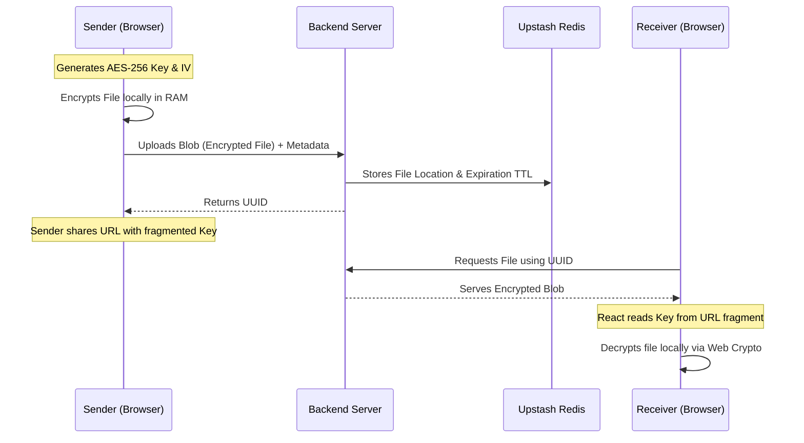

<br/>
<div align="center">
  
  <h1 align="center">CipherDrop</h1>
  <p align="center">
    <strong>Absolute Zero-Knowledge, End-to-End Encrypted File Transfer</strong>
  </p>
  
  <p align="center">
    <a href="#"></a>
    <a href="#"></a>
    <a href="#"></a>
    <a href="#"></a>
  </p>
</div>

<p align="center">
  <em>CipherDrop is an enterprise-grade file sharing application designed strictly for privacy. It ensures that files are encrypted locally within the browser before they ever touch the network. The backend server acts only as a blind relay; it has zero capability to decrypt your data.</em>
</p>

<hr />

## 📖 Table of Contents
- [Features](#-features)
- [Architecture & Cryptography](#-architecture--cryptography)
  - [Zero-Knowledge Protocol](#zero-knowledge-protocol)
  - [How it Works](#how-it-works)
- [Cinematic UI Engine](#-cinematic-ui-engine)
- [Quick Start Guide](#-quick-start)
- [Environment Variables](#-environment-variables)
- [Production Deployment](#-production-deployment)

<br/>

## ✨ Features

- **Hardened P2P Connectivity:**
  - `Multi-Protocol Tunneling`: Integrated UDP, TCP, and TLS (port 443) TURN support to bypass even the most restrictive corporate firewalls and Deep Packet Inspection (DPI).
  - `Connection Self-Healing`: Built-in connection watchdog that triggers automatic `RTCIceRestart` if a peer-to-peer connection hangs or drops.
  - `Unlimited P2P Sessions`: Option to keep P2P rooms persistent until the sender manually closes them, allowing multiple receivers to join sequentially.
- **True End-to-End Encryption (E2EE):** All encryption logic physically occurs inside the client's RAM using the Web Crypto API. The server never receives a decryption key.
- **Dual Flow Architecture:**
  - `Server Relay Mode`: Encrypt files up to 100MB and host them temporarily on an automated Upstash Redis backend that strictly enforces Time-to-Live (TTL) deletion.
  - `P2P Decentralized Mode`: Open a direct WebRTC Socket tunnel to another computer anywhere in the world and stream infinite sized files with no middle-man server.
- **Cryptographic Security Limits:** PBKDF2 Key derivation using SHA-256 with 100,000 iterations to withstand brute-force logic. 
- **Anti-DDoS Mechanics:** Backend API is shielded via `express-rate-limit` logic.

<br/>

## 🔐 Architecture & Cryptography

### Zero-Knowledge Protocol
The platform secures files using the URI Fragment (`#`) trick. When you upload a file, the AES-256 Encryption Key is structurally appended to the URL Fragment (`example.com/#/download/<ID>_<KEY>`). 

Because of standardized web protocol rules, **browsers never send URI fragments to servers**. When passing the URL to a friend, they download the blind encrypted blob from the server, and their local React app reads the key from the URI fragment to decrypt it. The server never sees the key.

### How it Works



<br/>

## 🎬 Cinematic UI Engine

This platform isn't just secure—it is visually stunning. The frontend React application features a built-in cinematic physics engine:

* **Hacker Boot Sequence:** The initial loading screen boots into a high-octane text decryption simulation.
* **3D Holographic Physics:** Cards mathematically warp and angle relative to your mouse coordinates (`transform-style: preserve-3d`).
* **Dynamic Spotlight Tracking:** Frosted glass panels project dynamic 'flashlight' glows underneath the surface, following your mouse path.
* **Staggered Orchestration:** Switching modules triggers a cascading DOM entrance, where components cascade into view smoothly.

<br/>

## 🚀 Quick Start

Ensure you have **Node.js (v18+)** installed.

### 1. Start the Backend API
First, set up your Database. Go to [Upstash](https://upstash.com/), create a free serverless Redis DB, and copy your connection string.

```bash
# Terminal 1: Navigate to the server
cd server
npm install

# Rename your env file and add your Upstash Key
# Set REDIS_URL=your_upstash_key
mv .env.example .env 

# Start the server (Runs on Port 3001)
npm start
```

### 2. Start the Frontend Application
```bash
# Terminal 2: Navigate to the client
cd client
npm install

# Start Vite React server (Runs on Port 5173/5174)
npm run dev
```

Open `http://localhost:5173/` in your browser.

<br/>

## ⚙️ Environment Variables

### Backend (`server/.env`)
| Variable | Description | Required |
|----------|-------------|----------|
| `REDIS_URL` | Your Upstash Redis connection string handling metadata and TTL limits. | **YES** |
| `CLIENT_URL` | Used for strict CORS enforcement. Default is `*` or `http://localhost:5173`. | No |

### Frontend (`client/.env`)
| Variable | Description | Required |
|----------|-------------|----------|
| `VITE_BACKEND_URL` | URL of your deployed `server`. Use this exclusively in Production. | No |

<br/>

## 🌍 Production Deployment

Because WebRTC `window.crypto` requires a Secure Context, **CipherDrop must be hosted over HTTPS.**

**The recommended free architecture:**
1. **Frontend (Vercel):** Connect your GitHub to Vercel and import the `client/` folder. Add the `VITE_BACKEND_URL` referring to your Render deploy.
2. **Backend (Render):** Deploy the `server/` folder as a **Node Web Service**. Paste your `REDIS_URL` safely into the environment menu.
3. **Keep-Alive:** Because free Render instances "sleep" and wipe ephemeral local disks, configure a free service like [cron-job.org](https://cron-job.org/) to ping your `https://your-render.onrender.com/health` route every 5 minutes so your physical links are never deleted randomly.

---
<div align="center">
  <i>Engineered for Maximum Security.</i>
</div>
